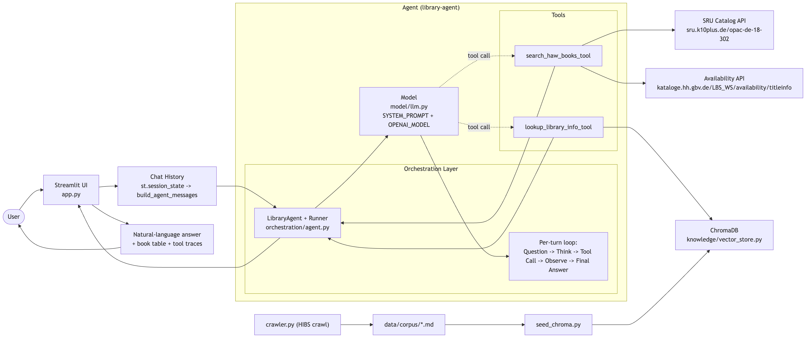

# Library Agent (HAW Hamburg)

Streamlit demo for explaining the core pieces of an agentic AI system:

- **Model**: the LLM configuration and system prompt.
- **Tools**: deterministic functions the model can call.
- **Orchestration Layer**: the agent runtime that connects model, tools, memory, and user input.

## Architecture

### Diagram



### Folder structure

```txt
library-agent/
  app.py                    # Streamlit UI

  model/
    llm.py                  # Model choice + system prompt

  orchestration/
    agent.py                # OpenAI Agents SDK: Agent, Runner, tool wiring, memory

  tools/
    catalog.py              # Live HAW catalog + availability tool backend
    library_info.py         # RAG lookup tool backend

  knowledge/
    crawler.py              # Crawls HIBS pages into markdown
    vector_store.py         # ChromaDB, chunking, embeddings, retrieval

  shared/
    schemas.py              # Pydantic data models shared across layers

  data/corpus/              # Crawled markdown files
  chroma_db/                # Generated Chroma vector database
```

## Concept Map

**Model**

The model layer defines what the agent is supposed to be and how it should behave.

- File: `model/llm.py`
- Key ideas:
  - model name
  - system prompt
  - response style
  - tool-use instructions

**Tools**

Tools are normal Python functions with clear inputs and outputs. The LLM decides when to call them, but the tool code does deterministic work.

- Files:
  - `tools/catalog.py`
  - `tools/library_info.py`
- Demo examples:
  - Search books in the HAW catalog.
  - Fetch live availability and shelfmark.
  - Retrieve library info from ChromaDB.

**Orchestration Layer**

The orchestration layer owns the agent loop. It connects the model, tools, memory, and user request.

- File: `orchestration/agent.py`
- Uses:
  - OpenAI Agents SDK `Agent`
  - `Runner`
  - `@function_tool`
  - Explicit message history from Streamlit state (app-managed context)

**Knowledge / RAG**

RAG is treated as infrastructure behind a tool. The model does not query Chroma directly; it calls a tool that retrieves relevant chunks.

- Files:
  - `knowledge/crawler.py`
  - `knowledge/vector_store.py`
- Data:
  - `data/corpus/`
  - `chroma_db/`

## Setup

```bash
cd library-agent
cp .env.example .env
make run
```

Set your OpenAI key in `.env`:

```bash
OPENAI_API_KEY=...
OPENAI_MODEL=gpt-5.4-mini
```

If `OPENAI_API_KEY` is not set, vector seeding/querying uses a deterministic local hash-embedding fallback.

## Make Targets

- `make install`: create `.venv` and install dependencies
- `make crawl`: crawl HIBS pages into `data/corpus/`
- `make seed`: seed ChromaDB from existing `data/corpus/`
- `make run`: seed then start Streamlit (no crawl)
- `make run-fresh`: crawl + seed + start Streamlit
- `make clean`: remove `.venv`, `chroma_db`, and corpus

## Suggested Demo Prompts

- `Find 5 books about Python and tell me where I can get them.`
- `Wo ist Distributed Systems verfügbar?`
- `Wie sind die Öffnungszeiten der Campusbibliothek Berliner Tor?`
- `Wie heißt das Buch von Martin Kleppmann über data-intensive applications?`
